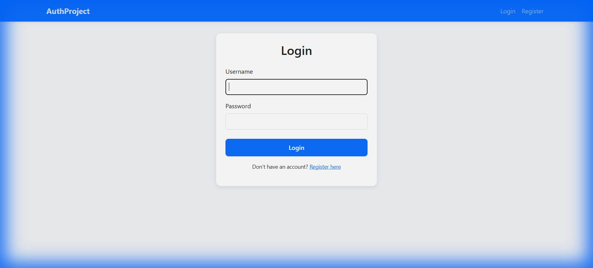

# Member Portal (02_authentication)



This project demonstrates the fundamental concepts of user authentication in Django. It's designed to be a clear, concise example for recruiters to show your understanding of Django's built-in auth system.

## Key Concepts Covered

1.  **Django User Model**: Using the built-in `auth.User` model to store user credentials.
2.  **Registration**: Implementing a sign-up flow using `UserCreationForm`.
3.  **Login/Logout**: Handling user sessions using `AuthenticationForm`, `login()`, and `logout()`.
4.  **`request.user`**: Accessing the currently logged-in user object in views and templates.
5.  **`is_authenticated`**: Checking if a user is logged in to show/hide UI elements (like the Logout button).
6.  **`@login_required`**: Protecting views from unauthorized access using decorators.
7.  **Session-based Authentication**: How Django uses cookies and server-side sessions to remember users.

## Project Structure

- `accounts/views.py`: Logic for registration, login, logout, and dashboard.
- `accounts/templates/`: HTML files for each auth stage.
- `MemberPortal/settings.py`: Configuration for auth redirects (`LOGIN_REDIRECT_URL`).

## How to Run

1.  Navigate to the project folder:
    ```bash
    cd 02_authentication
    ```
2.  Install Django (if not installed):
    ```bash
    pip install django
    ```
3.  Run migrations:
    ```bash
    python manage.py migrate
    ```
4.  Start the server:
    ```bash
    python manage.py runserver
    ```
5.  Visit `http://127.0.0.1:8000/register/` to create your first user.

## What I Learned

- **Built-in Forms**: Django provides robust forms like `UserCreationForm` which handle password hashing and validation out of the box.
- **Session Management**: Django manages session cookies automatically, making it easy to build secure "Remember Me" functionality.
- **Access Control**: The `@login_required` decorator is a powerful way to ensure only registered users can access sensitive pages.
- **Template Logic**: Using `` allows for a dynamic UI that changes based on the user's login state.
