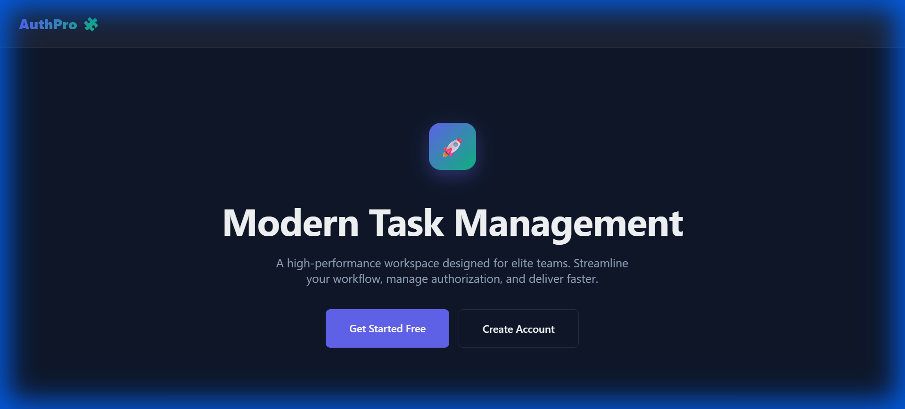

# TaskFlow (03_authorization)

This project demonstrates **Role-Based Authorization** in Django, specifically handling permissions for "Owner" and "User" roles.

## Key Features
- **Role Detection**: Distinguishes between Owners (staff) and regular Users.
- **Access Control**: Owners have full CRUD (Create, Read, Update, Delete) access to tasks, while Users have read-only access.
- **Login/Register**: Secure authentication flow for all members.
- **Task Management**: A robust system for managing team tasks with a modern UI.

## Technologies Used
- **Django**: Core web framework.
- **Bootstrap 5**: Responsive design and components.
- **SQLite**: Reliable local data storage.

## How to Run
1. Navigate to the project folder: `cd 03_authorization`
2. Run migrations: `python manage.py migrate`
3. Start server: `python manage.py runserver 8005`
4. Register a user and test the view-only access.
5. Create a superuser (`python manage.py createsuperuser`) to test Owner access.
