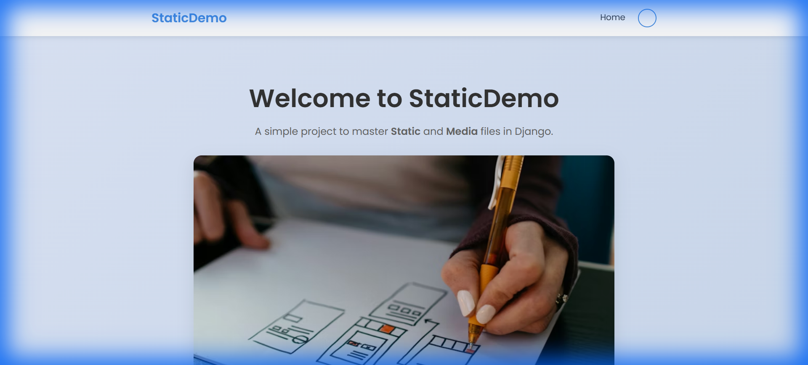

# Static and Media Demo (04_static_media)



A simple Django project designed to demonstrate the fundamental differences between **Static** and **Media** files, their configuration, and usage.

## 🚀 Technologies Used
- **Framework**: Django 5.x
- **Database**: SQLite (default)
- **Styling**: Vanilla CSS (Modern design with Glassmorphism cues)
- **Typography**: Google Fonts (Poppins)
- **Icons**: Custom CSS & Placeholder avatars

## 📂 Key Configuration
To handle files correctly, the following settings are used in `settings.py`:
- `STATIC_URL`: URL used to reference static files (CSS, JS, Logos).
- `STATICFILES_DIRS`: Additional locations where Django looks for static files.
- `MEDIA_URL`: URL used to reference user-uploaded files.
- `MEDIA_ROOT`: The actual folder on the server where uploaded files are stored.

---

## 🔄 Project Flow

### 1. Landing (Home Page)
The journey starts at the Home page, which serves as a demonstration of **Static** files. The CSS and background images are loaded from the `/static/` directory using the `` tag.

### 2. Navigation
Using the navbar, the user can navigate between Home and the Profile page. The links use the `` tag for dynamic routing.

### 3. Profile Management (Media Demo)
On the Profile page, the user can:
- **View**: See their current profile picture (loaded via `MEDIA_URL`).
- **Edit**: Update their **Display Name**, **Bio**, and **Profile Picture**.
- **Upload**: When a user selects a file, the `ProfileForm` processes the `request.FILES` dictionary.
- **Storage**: The uploaded image is saved into the `media/profile_pics/` folder as configured in the `Profile` model's `ImageField`.

### 4. Development Serving
In development, the `urls.py` file is configured to allow Django to serve these files directly:
```python
if settings.DEBUG:
    urlpatterns += static(settings.MEDIA_URL, document_root=settings.MEDIA_ROOT)
```

---

## 🛠️ Setup Instructions
1. **Initialize**: Run `python manage.py migrate` to set up the database.
2. **Run**: Start the server using `python manage.py runserver`.
3. **Explore**: Visit `http://127.0.0.1:8000/profile` to test the media upload functionality.
