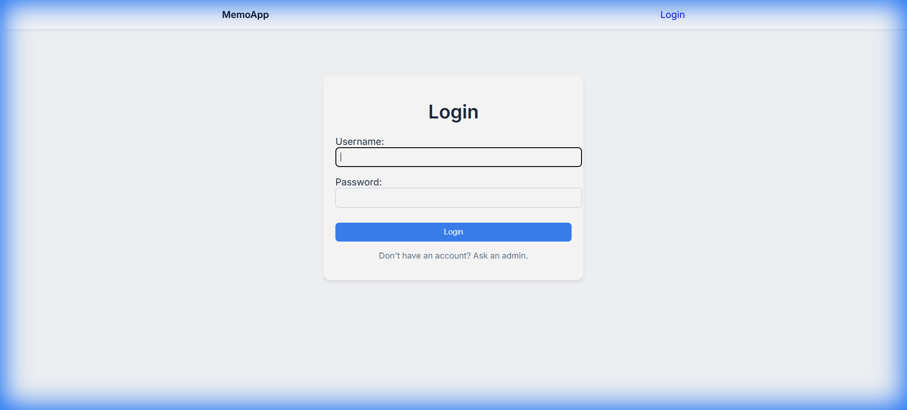

# Memo App (05_class_based_views)

 Demo)

A clean demonstration of Django's Generic Class-Based Views (CBVs) for building a Note-taking application.

## 🌟 Key Features
- **Generic CBVs**: Uses `ListView`, `DetailView`, `CreateView`, `UpdateView`, and `DeleteView`.
- **Authentication**: Secured using `LoginRequiredMixin`.
- **Authorization**: Custom ownership checks in `get_queryset` and using `UserPassesTestMixin`.
- **PK Routing**: Clean URLs using primary keys.

## 🛠️ Components Used
- **Django User Model**: For authentication and linking notes to owners.
- **LoginRequiredMixin**: Restricts access to authenticated users only.
- **UserPassesTestMixin**: Ensures users can only edit/delete their own notes.
- **reverse_lazy**: Handles redirection after successful form submissions in CBVs.

---

## 🔄 Application Flow

1. **Accessing the App**:
   - When a user visits the root URL, if they aren't logged in, they are redirected to `/accounts/login/`.

2. **Note Listing (`ListView`)**:
   - Once logged in, the user sees a list of notes they created.
   - Flow: `Note.objects.filter(owner=request.user)`.

3. **Creating a Note (`CreateView`)**:
   - Users click "+ New Note" and fill a form.
   - Flow: The `owner` is automatically assigned to the logged-in user in `form_valid()`.

4. **Viewing Details (`DetailView`)**:
   - Clicking a note title shows the full content.
   - Flow: `test_func()` verifies that the `request.user` is the owner before showing the page.

5. **Updating/Deleting (`UpdateView`, `DeleteView`)**:
   - Users can modify or remove their own notes.
   - Flow: `UserPassesTestMixin` prevents other users from accessing these views via direct URL manipulation.

---

## 🚀 How to Run
1. Run migrations: `python manage.py migrate`
2. Start server: `python manage.py runserver`
3. Login using `admin` / `admin123`.
